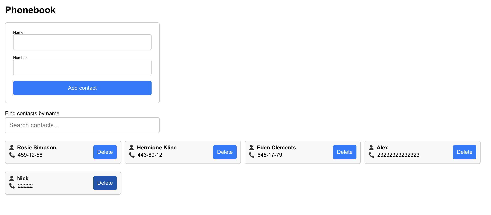

# Phonebook Application



This project is a simple Phonebook application that allows users to add, search, and delete contacts. It is built using React with Formik for form handling and Yup for form validation. The project also leverages modern CSS techniques, including CSS modules, to create a clean and responsive user interface.

## Features

- **Add Contacts**: Users can add new contacts by providing a name and phone number. Form validation is handled using Formik and Yup, ensuring that the inputs meet the required criteria.
- **Search Contacts**: The search functionality allows users to filter through the list of contacts by typing a name in the search box.
- **Delete Contacts**: Each contact has a delete button that allows users to remove a contact from the list.
- **Persistent Data**: Contacts are stored in localStorage, so the list of contacts is preserved even after the browser is closed or refreshed.

## Technologies Used

- **React**: A JavaScript library for building user interfaces.
- **Formik**: A library for building forms in React, providing a declarative approach to form handling.
- **Yup**: A schema builder for value parsing and validation.
- **CSS Modules**: A CSS file in which all class and animation names are scoped locally by default.
- **FontAwesome**: Used for displaying icons in the application.
- **Prettier**: An opinionated code formatter that ensures consistent code style across the project.

## Installation

To run this project locally, follow these steps:

1. **Clone the repository**:

```bash
 git clone https://github.com/your-username/phonebook-app.git
 cd phonebook-app

```

2. **Install the dependencies**:
   Make sure you have Node.js installed. Then run the following command:

```bash
  npm install
```

3. Run the application:
   To start the development server and run the application locally, execute:

```bash
  npm start
```
